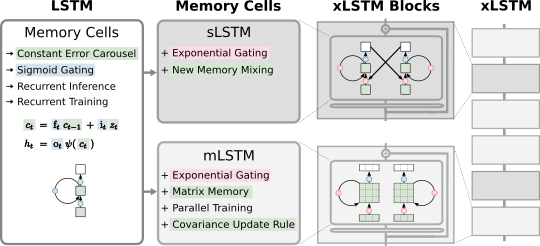

# xLSTM: Extended Long Short-Term Memory



> Paper: https://arxiv.org/abs/2405.04517

## About

xLSTM is a new Recurrent Neural Network architecture based on ideas of the original LSTM.
Through Exponential Gating with appropriate normalization and stabilization techniques and a new Matrix Memory it overcomes the limitations of the original LSTM 
and shows promising performance on Language Modeling when compared to Transformers or State Space Models.

## Minimal Installation

Create a conda environment from the file `environment_pt220cu121.yaml`.
Install the model code only (i.e. the module `xlstm`) as package:

Instally via pip: 
```bash
pip install xlstm
```
Clone from github:
```bash
git clone https://github.com/NX-AI/xlstm.git
cd xlstm
pip install -e .
```

## Requirements

This package is based on PyTorch and was tested for versions `>=1.8`. For the CUDA version of sLSTM, you need Compute Capability >= 8.0, see [https://developer.nvidia.com/cuda-gpus](https://developer.nvidia.com/cuda-gpus). For a well-tested environment, install the `environment_pt220cu121.yaml` as:
```bash
conda env create -n xlstm -f environment_pt220cu121.yaml
conda activate xlstm
``` 

## Usage

For non language applications or for integrating in other architectures you can use the `xLSTMBlockStack` and for language modeling or other token-based applications you can use the `xLSTMLMModel`.

### xLSTM Block Stack

The `xLSTMBLockStack` is meant for use as alternative backbone in existing projects. It is similar to a stack of Transformer blocks, but uses xLSTM blocks:

```python
import torch

from xlstm import (
    xLSTMBlockStack,
    xLSTMBlockStackConfig,
    mLSTMBlockConfig,
    mLSTMLayerConfig,
    sLSTMBlockConfig,
    sLSTMLayerConfig,
    FeedForwardConfig,
)

cfg = xLSTMBlockStackConfig(
    mlstm_block=mLSTMBlockConfig(
        mlstm=mLSTMLayerConfig(
            conv1d_kernel_size=4, qkv_proj_blocksize=4, num_heads=4
        )
    ),
    slstm_block=sLSTMBlockConfig(
        slstm=sLSTMLayerConfig(
            backend="cuda",
            num_heads=4,
            conv1d_kernel_size=4,
            bias_init="powerlaw_blockdependent",
        ),
        feedforward=FeedForwardConfig(proj_factor=1.3, act_fn="gelu"),
    ),
    context_length=256,
    num_blocks=7,
    embedding_dim=128,
    slstm_at=[1],

)

xlstm_stack = xLSTMBlockStack(cfg)

x = torch.randn(4, 256, 128).to("cuda")
xlstm_stack = xlstm_stack.to("cuda")
y = xlstm_stack(x)
y.shape == x.shape
```

If you are working with yaml strings / files for configuration you can also use dacite to create the config dataclasses. This is the same as the snippet above:

```python
from omegaconf import OmegaConf
from dacite import from_dict
from dacite import Config as DaciteConfig
from xlstm import xLSTMBlockStack, xLSTMBlockStackConfig

xlstm_cfg = """ 
mlstm_block:
  mlstm:
    conv1d_kernel_size: 4
    qkv_proj_blocksize: 4
    num_heads: 4
slstm_block:
  slstm:
    backend: cuda
    num_heads: 4
    conv1d_kernel_size: 4
    bias_init: powerlaw_blockdependent
  feedforward:
    proj_factor: 1.3
    act_fn: gelu
context_length: 256
num_blocks: 7
embedding_dim: 128
slstm_at: [1]
"""
cfg = OmegaConf.create(xlstm_cfg)
cfg = from_dict(data_class=xLSTMBlockStackConfig, data=OmegaConf.to_container(cfg), config=DaciteConfig(strict=True))
xlstm_stack = xLSTMBlockStack(cfg)

x = torch.randn(4, 256, 128).to("cuda")
xlstm_stack = xlstm_stack.to("cuda")
y = xlstm_stack(x)
y.shape == x.shape

```


### xLSTM Language Model

The `xLSTMLMModel` is a wrapper around the `xLSTMBlockStack` that adds the token embedding and lm head.

```python
from omegaconf import OmegaConf
from dacite import from_dict
from dacite import Config as DaciteConfig
from xlstm import xLSTMLMModel, xLSTMLMModelConfig

xlstm_cfg = """ 
vocab_size: 50304
mlstm_block:
  mlstm:
    conv1d_kernel_size: 4
    qkv_proj_blocksize: 4
    num_heads: 4
slstm_block:
  slstm:
    backend: cuda
    num_heads: 4
    conv1d_kernel_size: 4
    bias_init: powerlaw_blockdependent
  feedforward:
    proj_factor: 1.3
    act_fn: gelu
context_length: 256
num_blocks: 7
embedding_dim: 128
slstm_at: [1]
"""
cfg = OmegaConf.create(xlstm_cfg)
cfg = from_dict(data_class=xLSTMLMModelConfig, data=OmegaConf.to_container(cfg), config=DaciteConfig(strict=True))
xlstm_stack = xLSTMLMModel(cfg)

x = torch.randint(0, 50304, size=(4, 256)).to("cuda")
xlstm_stack = xlstm_stack.to("cuda")
y = xlstm_stack(x)
y.shape[1:] == (256, 50304)
```


## Experiments

The synthetic experiments show-casing the benefits of sLSTM over mLSTM and vice versa best are the Parity task and the Multi-Query Associative Recall task. The Parity task can only be solved with state-tracking capabilities provided by the memory-mixing of sLSTM. The Multi-Query Associative Recall task measures memorization capabilities, where the matrix-memory and state expansion of mLSTM is very beneficial.
In combination they do well on both tasks.

To run each, run the `main.py` in the experiments folder like:
```
python experiments/main.py --config experiments/parity_xLSTM01.yaml   # xLSTM[0:1], sLSTM only
python experiments/main.py --config experiments/parity_xLSTM10.yaml   # xLSTM[1:0], mLSTM only
python experiments/main.py --config experiments/parity_xLSTM11.yaml   # xLSTM[1:1], mLSTM and sLSTM
```

Note that the training loop does not contain early stopping or test evaluation.


## Citation

If you use this codebase, or otherwise find our work valuable, pleace cite the xLSTM paper:
```
@article{xlstm,
  title={xLSTM: Extended Long Short-Term Memory},
  author={Beck, Maximilian and P{\"o}ppel, Korbinian and Spanring, Markus and Auer, Andreas and Prudnikova, Oleksandra and Kopp, Michael and Klambauer, G{\"u}nter and Brandstetter, Johannes and Hochreiter, Sepp},
  journal={arXiv preprint arXiv:2405.04517},
  year={2024}
}

```