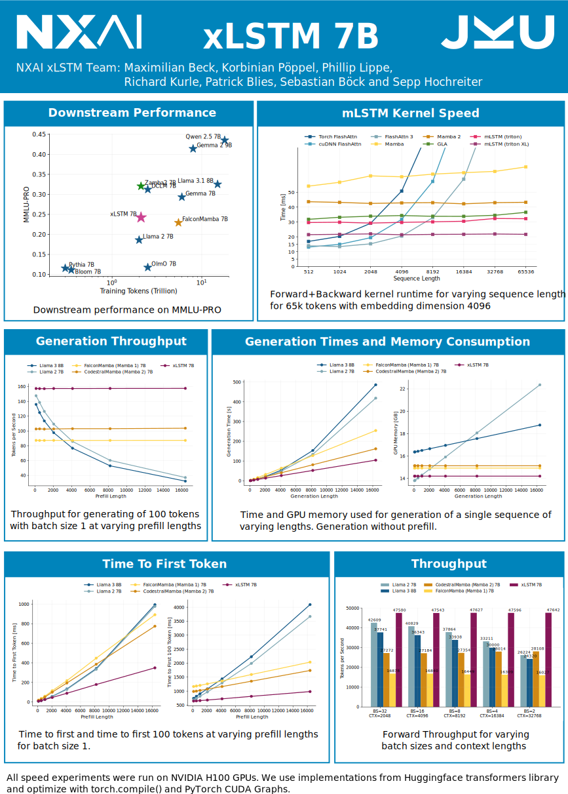

# xLSTM: Extended Long Short-Term Memory


> Paper: https://arxiv.org/abs/2405.04517
>
> Authors: Maximilian Beck, Korbinian Pöppel, Markus Spanring, Andreas Auer, Oleksandra Prudnikova, Michael Kopp, Günter Klambauer, Johannes Brandstetter, Sepp Hochreiter

## About

xLSTM is a new Recurrent Neural Network architecture based on ideas of the original LSTM.
Through Exponential Gating with appropriate normalization and stabilization techniques and a new Matrix Memory it overcomes the limitations of the original LSTM 
and shows promising performance on Language Modeling when compared to Transformers or State Space Models.

:rotating_light: We trained a 7B parameter xLSTM Language Model on 2.3T tokens! :rotating_light:

We refer to the optimized architecture for our xLSTM 7B as xLSTM Large. 

## Minimal Installation

Create a conda environment from the file `environment_pt240cu124.yaml`.
Install the model code only (i.e. the module `xlstm`) as package:

For using the xLSTM Large 7B model install [`mlstm_kernels`](https://github.com/NX-AI/mlstm_kernels) via:
``` 
pip install mlstm_kernels
```
Then install the xlstm package via pip: 
```bash
pip install xlstm
```
Or clone from github:
```bash
git clone https://github.com/NX-AI/xlstm.git
cd xlstm
pip install -e .
```

## Requirements

This package is based on PyTorch and was tested for versions `>=1.8`. For a well-tested environment, install the `environment_pt240cu124.yaml` as:
```bash
conda env create -n xlstm -f environment_pt240cu124.yaml
conda activate xlstm
``` 

For the xLSTM Large 7B model we require our [`mlstm_kernels`](https://github.com/NX-AI/mlstm_kernels) package, which provides fast kernels for the xLSTM.

# xLSTM 7B: A Recurrent LLM for Fast and Efficient Inference

> Paper: https://arxiv.org/abs/2503.13427
>
> Authors: Maximilian Beck, Korbinian Pöppel, Phillip Lippe, Richard Kurle, Patrick M. Blies, Günter Klambauer, Sebastian Böck, Sepp Hochreiter



We have optimized the xLSTM architecture in terms of training throughput and stability. 
The code for the updated architecture is located in `xlstm/xlstm_large`.

The model weights are available on Huggingface at https://huggingface.co/NX-AI/xLSTM-7b. 

## How to use the xLSTM Large 7B and its architecture

We provide a standalone single file implementation of the xLSTM Large architecture in [`xlstm/xlstm_large/model.py`](https://github.com/NX-AI/xlstm/blob/main/xlstm/xlstm_large/model.py).
This implementation requires our [`mlstm_kernels`](https://github.com/NX-AI/mlstm_kernels) package and other than that has no dependency on the NeurIPS xLSTM architecture implementation.

For a quick start, we provide a [`demo.ipynb`](https://github.com/NX-AI/xlstm/blob/main/notebooks/xlstm_large/demo.ipynb) notebook for the xLSTM Large architecture at `notebooks/xlstm_large/demo.ipynb`. 

In this notebook we import our config and model class, initialize a random model and perform a forward pass, like so:

```python
import torch
from xlstm.xlstm_large.model import xLSTMLargeConfig, xLSTMLarge

# configure the model with TFLA Triton kernels
xlstm_config = xLSTMLargeConfig(
    embedding_dim=512,
    num_heads=4,
    num_blocks=6,
    vocab_size=2048,
    return_last_states=True,
    mode="inference",
    chunkwise_kernel="chunkwise--triton_xl_chunk", # xl_chunk == TFLA kernels
    sequence_kernel="native_sequence__triton",
    step_kernel="triton",
)
# instantiate the model
xlstm = xLSTMLarge(xlstm_config)
xlstm = xlstm.to("cuda")
# create inputs
input = torch.randint(0, 2048, (3, 256)).to("cuda")
# run a forward pass
out = xlstm(input)
out.shape[1:] == (256, 2048)
```

## Recommendation for other hardware

We have tested our model mostly on NVIDIA GPUs, however our Triton kernels should also run on AMD GPUs. 
For other platforms, like Apple Metal, we recommend using the native PyTorch implementations for now:

```python 
xlstm_config = xLSTMLargeConfig(
    embedding_dim=512,
    num_heads=4,
    num_blocks=6,
    vocab_size=2048,
    return_last_states=True,
    mode="inference",
    chunkwise_kernel="chunkwise--native_autograd", # no Triton kernels
    sequence_kernel="native_sequence__native", # no Triton kernels
    step_kernel="native", # no Triton kernels
)
```

# Models from the xLSTM NeurIPS Paper

This section explains how to use the models from the xLSTM paper.

## How to use the xLSTM architecture from our NeurIPS paper

For non language applications or for integrating in other architectures you can use the `xLSTMBlockStack` and for language modeling or other token-based applications you can use the `xLSTMLMModel`.

### Using the sLSTM CUDA kernels

For the CUDA version of sLSTM, you need Compute Capability >= 8.0, see [https://developer.nvidia.com/cuda-gpus](https://developer.nvidia.com/cuda-gpus). If you have problems with the compilation, please try (thanks to [@zia1138](https://github.com/zia1138) for pointing out):
```bash
export TORCH_CUDA_ARCH_LIST="8.0;8.6;9.0"
```

For all kinds of custom setups with torch and CUDA, keep in mind that versions have to match. Also, to make sure the correct CUDA libraries are included you can use the "XLSTM_EXTRA_INCLUDE_PATHS" environment variable now to inject different include paths, e.g.:

```bash
export XLSTM_EXTRA_INCLUDE_PATHS='/usr/local/include/cuda/:/usr/include/cuda/'
```

or within python:

```python
import os
os.environ['XLSTM_EXTRA_INCLUDE_PATHS']='/usr/local/include/cuda/:/usr/include/cuda/'
```

for standalone, even faster sLSTM kernels, feel free to use the [FlashRNN](https://github.com/NX-AI/flashrnn) library.

### xLSTM Block Stack

The `xLSTMBLockStack` is meant for use as alternative backbone in existing projects. It is similar to a stack of Transformer blocks, but uses xLSTM blocks:

```python
import torch

from xlstm import (
    xLSTMBlockStack,
    xLSTMBlockStackConfig,
    mLSTMBlockConfig,
    mLSTMLayerConfig,
    sLSTMBlockConfig,
    sLSTMLayerConfig,
    FeedForwardConfig,
)

cfg = xLSTMBlockStackConfig(
    mlstm_block=mLSTMBlockConfig(
        mlstm=mLSTMLayerConfig(
            conv1d_kernel_size=4, qkv_proj_blocksize=4, num_heads=4
        )
    ),
    slstm_block=sLSTMBlockConfig(
        slstm=sLSTMLayerConfig(
            backend="cuda",
            num_heads=4,
            conv1d_kernel_size=4,
            bias_init="powerlaw_blockdependent",
        ),
        feedforward=FeedForwardConfig(proj_factor=1.3, act_fn="gelu"),
    ),
    context_length=256,
    num_blocks=7,
    embedding_dim=128,
    slstm_at=[1],

)

xlstm_stack = xLSTMBlockStack(cfg)

x = torch.randn(4, 256, 128).to("cuda")
xlstm_stack = xlstm_stack.to("cuda")
y = xlstm_stack(x)
y.shape == x.shape
```

If you are working with yaml strings / files for configuration you can also use dacite to create the config dataclasses. This is the same as the snippet above:

```python
from omegaconf import OmegaConf
from dacite import from_dict
from dacite import Config as DaciteConfig
from xlstm import xLSTMBlockStack, xLSTMBlockStackConfig

xlstm_cfg = """ 
mlstm_block:
  mlstm:
    conv1d_kernel_size: 4
    qkv_proj_blocksize: 4
    num_heads: 4
slstm_block:
  slstm:
    backend: cuda
    num_heads: 4
    conv1d_kernel_size: 4
    bias_init: powerlaw_blockdependent
  feedforward:
    proj_factor: 1.3
    act_fn: gelu
context_length: 256
num_blocks: 7
embedding_dim: 128
slstm_at: [1]
"""
cfg = OmegaConf.create(xlstm_cfg)
cfg = from_dict(data_class=xLSTMBlockStackConfig, data=OmegaConf.to_container(cfg), config=DaciteConfig(strict=True))
xlstm_stack = xLSTMBlockStack(cfg)

x = torch.randn(4, 256, 128).to("cuda")
xlstm_stack = xlstm_stack.to("cuda")
y = xlstm_stack(x)
y.shape == x.shape

```


### xLSTM Language Model

The `xLSTMLMModel` is a wrapper around the `xLSTMBlockStack` that adds the token embedding and lm head.

```python
from omegaconf import OmegaConf
from dacite import from_dict
from dacite import Config as DaciteConfig
from xlstm import xLSTMLMModel, xLSTMLMModelConfig

xlstm_cfg = """ 
vocab_size: 50304
mlstm_block:
  mlstm:
    conv1d_kernel_size: 4
    qkv_proj_blocksize: 4
    num_heads: 4
slstm_block:
  slstm:
    backend: cuda
    num_heads: 4
    conv1d_kernel_size: 4
    bias_init: powerlaw_blockdependent
  feedforward:
    proj_factor: 1.3
    act_fn: gelu
context_length: 256
num_blocks: 7
embedding_dim: 128
slstm_at: [1]
"""
cfg = OmegaConf.create(xlstm_cfg)
cfg = from_dict(data_class=xLSTMLMModelConfig, data=OmegaConf.to_container(cfg), config=DaciteConfig(strict=True))
xlstm_stack = xLSTMLMModel(cfg)

x = torch.randint(0, 50304, size=(4, 256)).to("cuda")
xlstm_stack = xlstm_stack.to("cuda")
y = xlstm_stack(x)
y.shape[1:] == (256, 50304)
```


## Experiments

The synthetic experiments show-casing the benefits of sLSTM over mLSTM and vice versa best are the Parity task and the Multi-Query Associative Recall task. The Parity task can only be solved with state-tracking capabilities provided by the memory-mixing of sLSTM. The Multi-Query Associative Recall task measures memorization capabilities, where the matrix-memory and state expansion of mLSTM is very beneficial.
In combination they do well on both tasks.

To run each, run the `main.py` in the experiments folder like:
```
PYTHONPATH=. python experiments/main.py --config experiments/parity_xlstm01.yaml   # xLSTM[0:1], sLSTM only
PYTHONPATH=. python experiments/main.py --config experiments/parity_xlstm10.yaml   # xLSTM[1:0], mLSTM only
PYTHONPATH=. python experiments/main.py --config experiments/parity_xlstm11.yaml   # xLSTM[1:1], mLSTM and sLSTM
```

Note that the training loop does not contain early stopping or test evaluation.


## Citation

If you use this codebase, or otherwise find our work valuable, please cite the xLSTM paper:
```
@inproceedings{beck:24xlstm,
      title={xLSTM: Extended Long Short-Term Memory}, 
      author={Maximilian Beck and Korbinian Pöppel and Markus Spanring and Andreas Auer and Oleksandra Prudnikova and Michael Kopp and Günter Klambauer and Johannes Brandstetter and Sepp Hochreiter},
      booktitle = {Thirty-eighth Conference on Neural Information Processing Systems},
      year={2024},
      url={https://arxiv.org/abs/2405.04517}, 
}

@article{beck:25xlstm7b,
  title        = {{xLSTM 7B}: A Recurrent LLM for Fast and Efficient Inference},
  author       = {Maximilian Beck and Korbinian Pöppel and Phillip Lippe and Richard Kurle and Patrick M. Blies and Günter Klambauer and Sebastian Böck and Sepp Hochreiter},
  year         = {2025},
  volume       = {2503.13427},
  journal      = {arXiv},
  primaryclass = {cs.LG},
  url          = {https://arxiv.org/abs/2503.13427}
}

```
